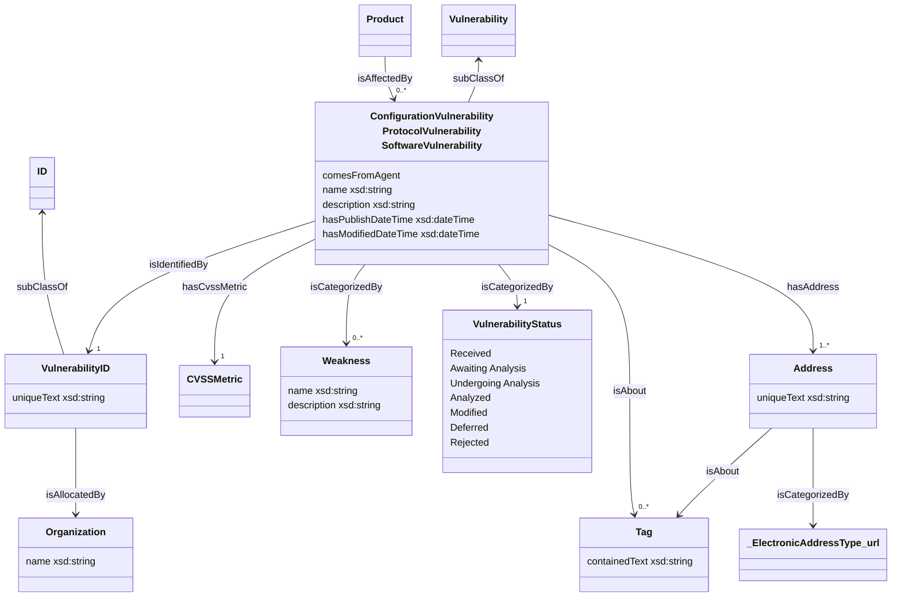

# Vulnerability

> Notes:
>
> - modified date time will only exist if the vulnerability has been modified. E.g., publish date != modified date.
> - Nist defines vulnerability statuses. More statuses can be added for different data sources as needed. See: https://nvd.nist.gov/vuln/vulnerability-status

> Questions:
>
> - Do we care about primary vs secondary CWEs?
> - Is a product affected by a vulnerability or the exploitation of a vulnerability?
> - Is the source of the reference important? Sometimes this is an email but can also be an UUID.

> Further Development:
>
> - Configurations
> - CVSS scores
