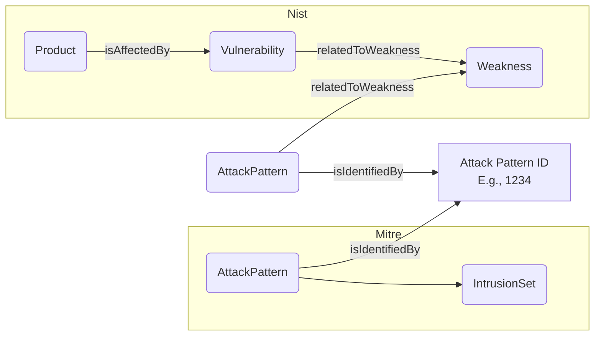
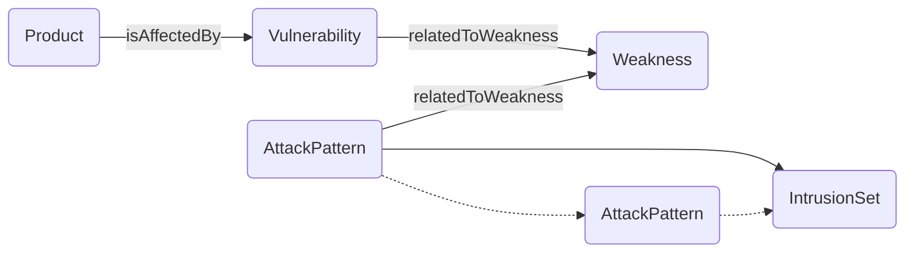

# Overview

## Current

Currently, attack patterns are from two different sources. These attack patterns have matching identifiers and are currently minted as two unique objects linked via their matching identifier.

## Ideal

Moving forward, attack patterns will be minted as one object or linked via an object property.
