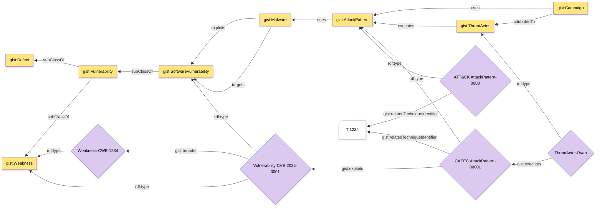

```mermaid
---
config:
  layout: fixed
  look: neo
  theme: classic

---
graph RL
    AttackPattern["gist:AttackPattern"] -- uses --> Malware
    Vulnerability[gist:Vulnerability] -- subClassOf --> Defect["gist:Defect"]
    Vulnerability -- subClassOf --> Weakness[gist:Weakness]
    
  
    SoftwareVulnerability["gist:SoftwareVulnerability"] --subClassOf --> Vulnerability
  

    Campaign["gist:Campaign"] -- uses --> AttackPattern
    Campaign -- attributedTo --> ThreatActor

    Malware[gist:Malware] -- exploits --> SoftwareVulnerability
    Malware -- targets --> SoftwareVulnerability
    ThreatActor["gist:ThreatActor"] -- executes --> AttackPattern
    Ryan@{ shape: diamond, label: "ThreatActor-Ryan"} -- gist:executes --> CAP
    Ryan -- rdf:type --> ThreatActor
    
    CWE@{ shape: diamond, label: "Weakness-CWE-1234"} -- rdf:type --> Weakness
    CVE@{ shape: diamond, label: "Vulnerability-CVE-2025-0001"} -- rdf:type --> SoftwareVulnerability
    CVE -- rdf:type --> Weakness
    CVE -- gist:broader --> CWE


    aAP -- gist:relatedTechniqueIdentifier --> T1234@{ shape: notch-rect, label: "T-1234"}

    CAP@{ shape: diamond, label: "CAPEC AttackPattern-00001"} -- rdf:type --> AttackPattern
    CAP -- gist:exploits --> CVE

    CAP -- gist:relatedTechniqueIdentifier --> T1234


    aAP@{ shape: diamond, label: "ATT&CK AttackPattern-0003"} -- rdf:type --> AttackPattern


classDef yellow fill:#ffe680, color:#000
classDef purple fill:#dbc9ef, color:#000
classDef white fill:#ffffff, color:#000


class ThreatActor,AttackPattern,Campaign,Identity,Infrastructure,Malware,Tool,Vulnerability,SoftwareVulnerability,Location,IntrusionSet,Indicator,Weakness,Defect,Software,Device yellow
class CWE,CVE,CAP,aAP,Ryan purple
class T1234 white
```
