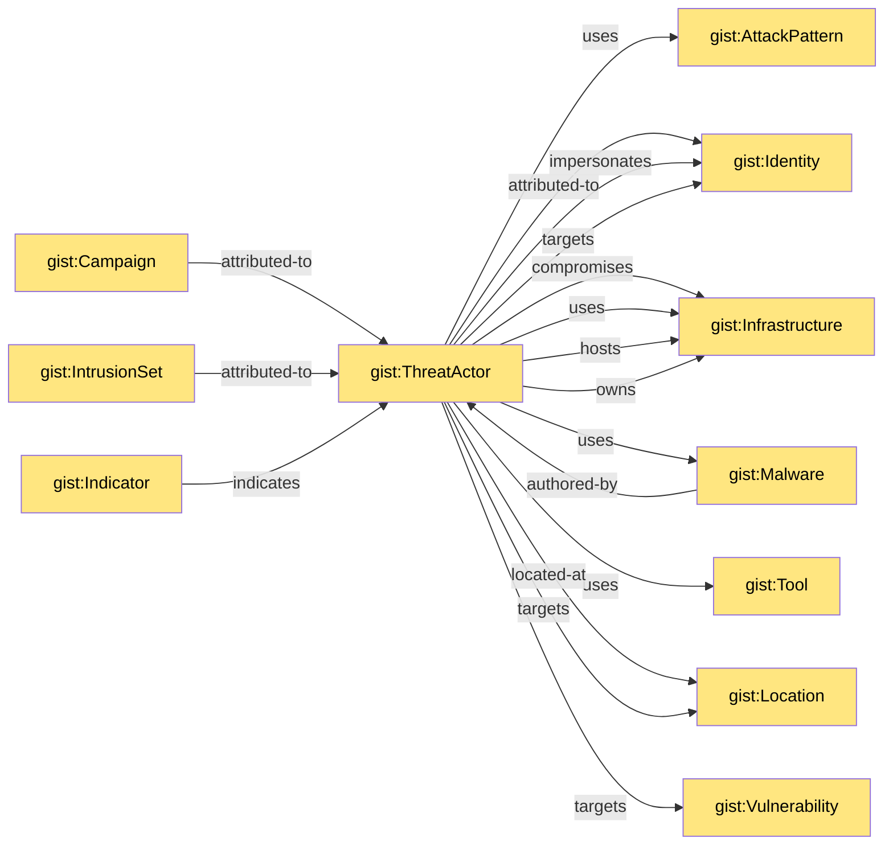

```mermaid

graph LR


Campaign[gist:Campaign] -- attributed-to --> ThreatActor
IntrusionSet[gist:IntrusionSet] -- attributed-to --> ThreatActor
Indicator[gist:Indicator] -- indicates --> ThreatActor
Malware -- authored-by --> ThreatActor


ThreatActor[gist:ThreatActor] -- uses --> AttackPattern[gist:AttackPattern]
ThreatActor -- attributed-to --> Identity[gist:Identity]
ThreatActor -- compromises --> Infrastructure[gist:Infrastructure]
ThreatActor -- uses --> Infrastructure
ThreatActor -- uses --> Malware[gist:Malware]
ThreatActor -- uses --> Tool[gist:Tool]
ThreatActor -- hosts --> Infrastructure
ThreatActor -- owns --> Infrastructure 
ThreatActor -- impersonates --> Identity
ThreatActor -- located-at --> Location[gist:Location]
ThreatActor -- targets --> Identity
ThreatActor -- targets --> Location
ThreatActor -- targets --> Vulnerability[gist:Vulnerability]


classDef yellow fill:#ffe680, color:#000
classDef purple fill:#dbc9ef, color:#000
classDef white fill:#ffffff, color:#000

class ThreatActor,AttackPattern,Campaign,Identity,Infrastructure,Malware,Tool,Vulnerability,Location,IntrusionSet,Indicator yellow


```