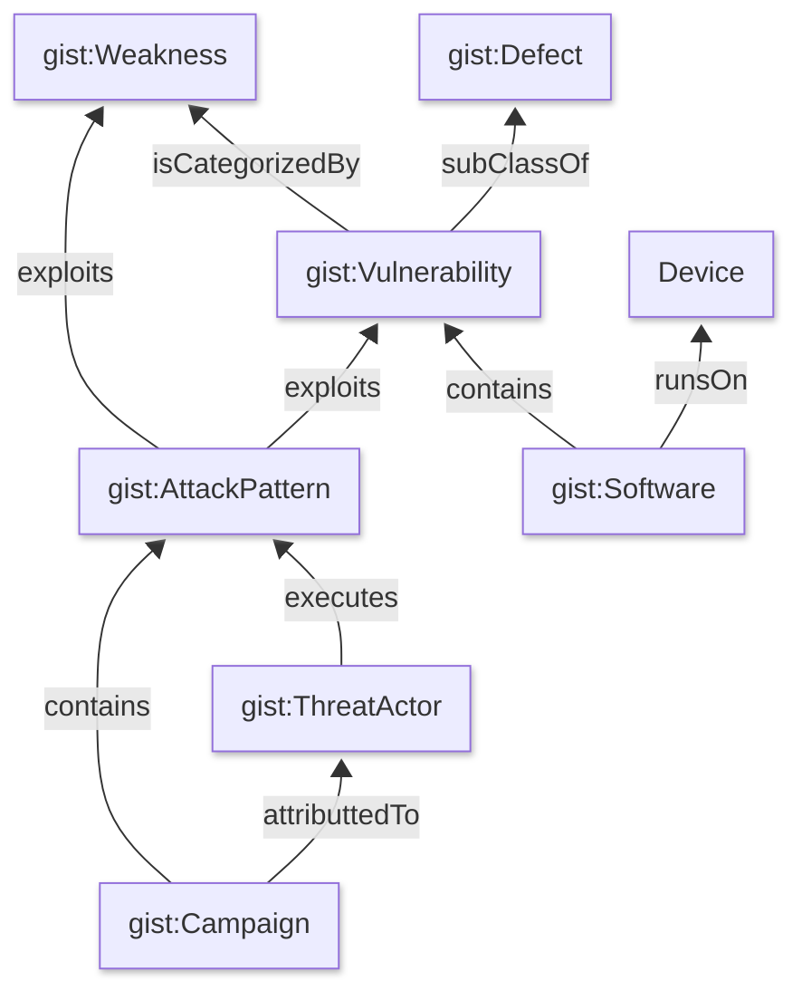

```mermaid
---
config:
  layout: fixed
  look: neo
  theme: classic

---
graph BT
    Vulnerability["gist:Vulnerability"] -- isCategorizedBy --> Weakness["gist:Weakness"]
    AttackPattern["gist:AttackPattern"] -- exploits --> Weakness & Vulnerability
    Software["gist:Software"] -- contains --> Vulnerability
    Software -- runsOn --> Device 
    Vulnerability -- subClassOf --> Defect["gist:Defect"]
    ThreatActor["gist:ThreatActor"] -- executes --> AttackPattern
    Campaign["gist:Campaign"] -- contains --> AttackPattern
    Campaign -- attributtedTo --> ThreatActor


```
