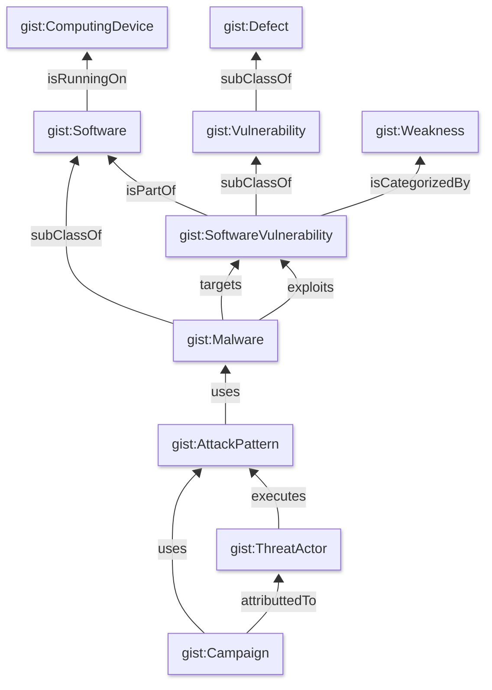

```mermaid
---
config:
  layout: fixed
  look: neo
  theme: classic

---
graph BT
    AttackPattern["gist:AttackPattern"] -- uses --> Malware
    Vulnerability[gist:Vulnerability] -- subClassOf --> Defect["gist:Defect"]
    Software -- isRunningOn --> Device[gist:ComputingDevice]
    SoftwareVulnerability["gist:SoftwareVulnerability"] -- isCategorizedBy --> Weakness["gist:Weakness"]   
    SoftwareVulnerability --subClassOf --> Vulnerability
    SoftwareVulnerability -- isPartOf --> Software["gist:Software"]
    Malware[gist:Malware] -- subClassOf --> Software
    Malware -- exploits --> SoftwareVulnerability
    Malware -- targets --> SoftwareVulnerability
    ThreatActor["gist:ThreatActor"] -- executes --> AttackPattern
    Campaign["gist:Campaign"] -- uses --> AttackPattern
    Campaign -- attributtedTo --> ThreatActor


```
